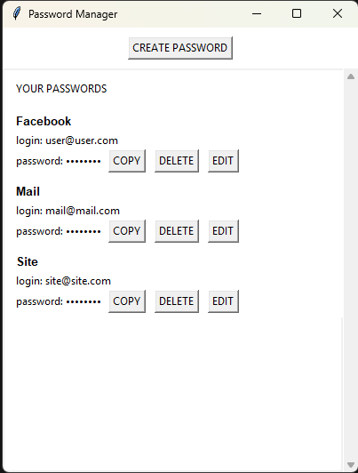

# Password Manager

A simple local password manager built with Python and Tkinter.

## Features

- Create passwords with customizable options (uppercase, numbers, symbols)
- Generate secure random passwords
- Copy passwords to clipboard with one click
- Edit existing passwords
- Delete passwords
- Passwords stored locally in JSON format

## Technologies

- Python 3.6+
- Tkinter (GUI)
- secrets (secure password generation)
- string (character sets)
- json (local storage)

## How to Run

1. Clone the repository

2. Navigate to the project folder

3. Run the app (main.py)

The current version of this app was developed for local use only. Once you generate your passwords and send them to production, the unwanted access to the json file (password_manager/core/data/passwords.json), where your passwords are stored, means that you passwords are vulnerable.